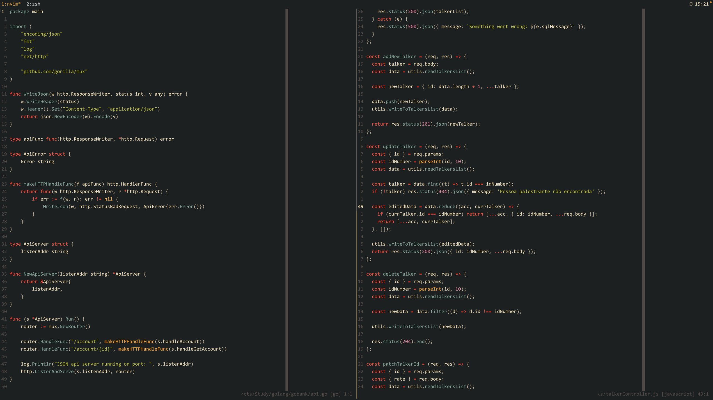

<div align="center">
        
  <h1>gruvbox-minor.nvim</h1>
</div>


Neovim theme heavily based on the [Gruvbox Minor VS**** theme](https://github.com/adamsome/vscode-theme-gruvbox-minor), written in Lua with Treesitter support!





This colorscheme was made for personal use.<br>
I mainly code in Typescript and Golang, so there might be a few highlight groups that were not set yet.
I also use treesitter, so I didn't bother making the theme work without it.
Therefore, PR's are more than welcome.

## Installation

### Lazy

```lua
{
  "ricardoraposo/gruvbox-minor.nvim",
  lazy = false,
  priority = 1000,
  opts = {},
}
```

### Packer

```lua
use ("ricardoraposo/gruvbox-minor.nvim")
```

## Usage

### Vim Script

```vim
colorscheme gruvbox-minor
```

### Lua

```lua
vim.cmd.colorscheme("gruvbox-minor")
```


## Acknowledgements

- [adamsome/gruvbox minor for vscode](https://github.com/adamsome/vscode-theme-gruvbox-minor) for creating the original theme
- [LunarVim/onedarker.nvim](https://github.com/LunarVim/onedarker.nvim) was used as an inspiration for the lua porting
- [Djanho](https://github.com/viniciusmuller/djanho) was used to create the first highlight groups from the original vs**** version
